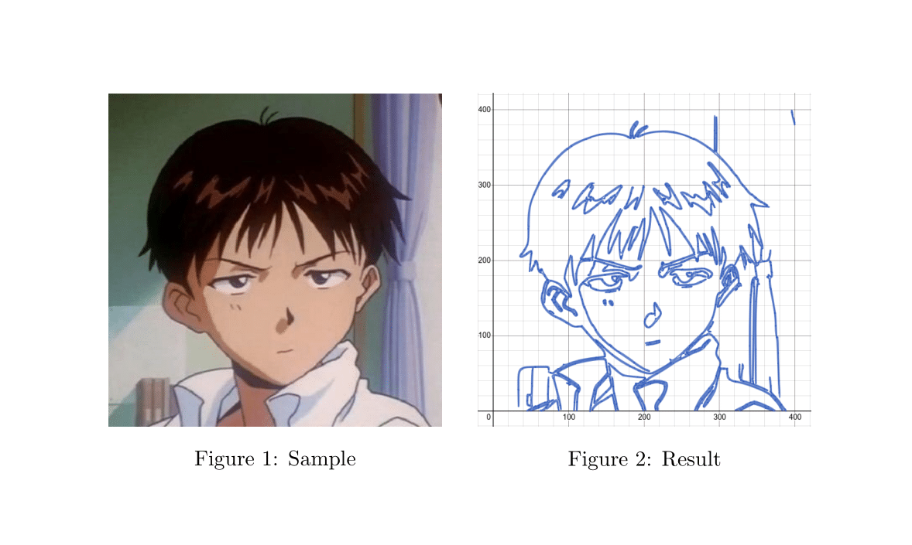

# Desmos Bezier Renderer

A simple image/video to Desmos graph converter run locally. Rotoscopes images using Canny and Potrace edge detection as Bezier curves on Desmos Graphing Calculator.



## Setup
#### This guide won't work out of the box on Windows. The easiest way to do this on Windows is to [install WSL](https://learn.microsoft.com/en-us/windows/wsl/install) to run all the commands below. You can find it produces under the `\\wsl$\Ubuntu-20.04\home` path on your PC.
Install dependencies
```sh
sudo apt update
sudo apt install git python3-dev python3-pip build-essential libagg-dev libpotrace-dev pkg-config
```

Clone repository
```sh
git clone https://github.com/kevinjycui/DesmosBezierRenderer.git
cd DesmosBezierRenderer
```

Install requirements
```sh
python -m venv env
. env/bin/activate
pip install wheel
pip install -r requirements.txt
```
Replace the images in the `frames` directory with your own and name each image `frame%d.png` where `%d` represents the frame-number starting from 1. To render just a single image, add a single image named `frame1.png` in the directory. The renderer will work best with 360p to 480p resolution images (you may have to lower the resolution further with more complex frames).
```sh
rm -r frames
mkdir frames
...
```
#### Settings
Constants in the `backend.py` file can be changed to optimise or customise your render via command-line arguments.

```sh
$ python backend.py -h
backend.py -f <source> -e <extension> -c <colour> -b -d -l -g --yes

	-h	Get help

-Options

	-f <source>	The directory from which the frames are stored (e.g. frames)
	-e <extension>	The extension of the frame files (e.g. png)
	-c <colour>	The colour of the lines to be drawn (e.g. #2464b4)
	-b		Reduce number of lines with bilateral filter for simpler renders
	-d		Download rendered frames automatically
	-l		Reduce number of lines with L2 gradient for quicker renders
	-g		Hide the grid in the background of the graph
	
	--yes		Agree to EULA without input prompt
```

Use `python backend.py -h` to see the above help message. Run without any command-line arguments to create a rendering with the same settings as seen in [this video](https://www.youtube.com/watch?v=BQvBq3K50u8). 

#### Running the command

Run the backend (This may take a while depending on the size and complexity of the frames). It should eventually show that the server is running on `http://127.0.0.1:5000` with the render available at `http://127.0.0.1:5000/calculator`.
```sh
python backend.py
```

The following is an example of the output:
```sh
$ python backend.py 
  _____                                
 |  __ \                               
 | |  | | ___  ___ _ __ ___   ___  ___ 
 | |  | |/ _ \/ __| '_ ` _ \ / _ \/ __|
 | |__| |  __/\__ \ | | | | | (_) \__ \
 |_____/ \___||___/_| |_| |_|\___/|___/

                   BEZIER RENDERER
Junferno 2021
https://github.com/kevinjycui/DesmosBezierRenderer

 = COPYRIGHT =
©Copyright Junferno 2021-2023. This program is licensed under the [GNU General Public License](https://github.com/kevinjycui/DesmosBezierRenderer/blob/master/LICENSE). Please provide proper credit to the author (Junferno) in any public media that uses this software. Desmos Bezier Renderer is in no way, shape, or form endorsed by or associated with Desmos, Inc.

 = EULA =
By using Desmos Bezier Renderer, you agree to comply to the [Desmos Terms of Service](https://www.desmos.com/terms). The Software and related documentation are provided “AS IS” and without any warranty of any kind. Desmos Bezier Renderer is not responsible for any User application or modification that constitutes a breach in terms. User acknowledges and agrees that the use of the Software is at the User's sole risk. The developer kindly asks Users to not use Desmos Bezier Renderer to enter into Desmos Math Art competitions, for the purpose of maintaining fairness and integrity.

                                      Agree (y/n)? y
-----------------------------
Processing 513 frames... Please wait for processing to finish before running on frontend

--> Processing complete in 4.5 seconds

		===========================================================================
		|| GO CHECK OUT YOUR RENDER NOW AT:					 ||
		||			http://127.0.0.1:5000/calculator		 ||
		===========================================================================

=== SERVER LOG (Ignore if not dev) ===
 * Serving Flask app 'backend'
 * Debug mode: off
WARNING: This is a development server. Do not use it in a production deployment. Use a production WSGI server instead.
 * Running on http://127.0.0.1:5000
Press CTRL+C to quit

```

Load `http://127.0.0.1:5000/calculator` into a web browser and put `f=1` into the first formula in the formula window. The image should start rendering or the video should start [playing at a slow rate](https://www.youtube.com/watch?v=BQvBq3K50u8).


## Copyright

©Copyright Junferno 2021-2023. This program is licensed under the [GNU General Public License](https://github.com/kevinjycui/DesmosBezierRenderer/blob/master/LICENSE). Please provide proper credit to the author (Junferno) in any public media that uses this software. Desmos Bezier Renderer is in no way, shape, or form endorsed by or associated with Desmos, Inc.

## EULA
```
By using Desmos Bezier Renderer, you agree to comply to the [Desmos Terms of Service](https://www.desmos.com/terms). The Software and related documentation are provided “AS IS” and without any warranty of any kind. Desmos Bezier Renderer is not responsible for any User application or modification that constitutes a breach in terms. User acknowledges and agrees that the use of the Software is at the User's sole risk. The developer kindly asks Users to not use Desmos Bezier Renderer to enter into Desmos Math Art competitions, for the purpose of maintaining fairness and integrity.
```
